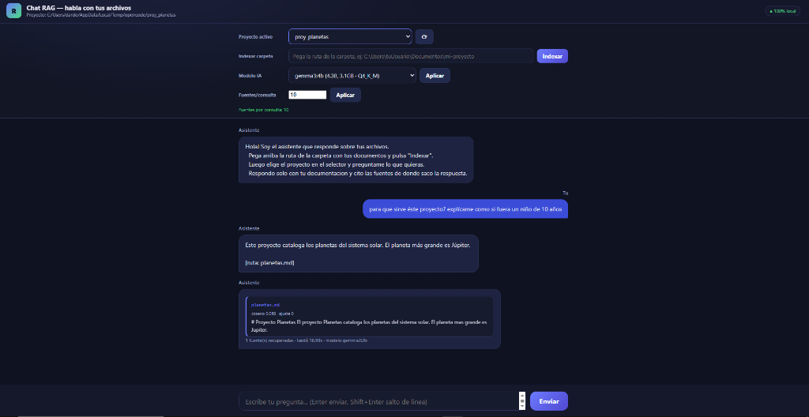

# Chat RAG — habla con tus archivos

Aplicación local para hacer preguntas y obtener respuestas sobre cualquier
carpeta de tu PC, citando las fuentes de donde se extrae cada respuesta.

<p align="center">
  
</p>

100% local: usa un modelo de embeddings y un LLM (via Ollama) corriendo en tu
máquina. No se sube ningún dato a internet.

## Requisitos

- Python 3 (con las librerias indicadas abajo)
- [Ollama](https://ollama.com) corriendo en `127.0.0.1:11434`
- Un modelo LLM descargado, p. ej. `gemma2:2b` o `gemma3:4b`

Librerias de Python:

```
pip install numpy sentence-transformers
```

## Descargar los modelos (placa basica)

Si tu PC no tiene GPU dedicada (4-8 GB de RAM) usa los modelos ligeros:

1. Doble clic en `descargar_modelos.bat`.
2. Elige `A` (descargar todos) o `Enter` (solo `gemma2:2b`).

Recomendados para equipos basicos:

| Modelo | Tamano | Uso |
|---|---|---|
| `gemma2:2b` | 1.63 GB | default, equilibrado |
| `qwen2.5-coder:1.5b` | 0.99 GB | minimo RAM |
| `gemma3:4b` | 3.34 GB | mas calidad (necesita mas RAM) |

O bien, desde terminal: `ollama pull gemma2:2b`.

> Cuanto menos RAM tengas, prefiere modelos de 1-2B. Personalizalo siempre
> desde el selector de la interfaz web (`chat_web.bat`).

## Inicio Rápido (1 Clic) 🚀

Simplemente haz doble clic en **`iniciar_servidor.bat`**.

El script se encarga de todo automáticamente:
1. Verifica que tengas Python e instala las dependencias (`numpy`, `sentence-transformers`) si faltan.
2. Comprueba e inicia el servicio de **Ollama**.
3. Descarga el modelo de lenguaje (`gemma2:2b`) si todavía no lo tienes.
4. Descarga el modelo de embeddings multilingüe en su primer uso (y luego opera 100% offline).
5. Abre la interfaz web en tu navegador lista para usar.

---

## Uso manual / paso a paso

### 1) Indexar una carpeta

```
python rag_index.py --folder "C:\ruta\a\tus\archivos"
```

Esto crea el indice en `output/indices/<nombre>.pkl`. Puedes indexar varias
carpetas: cada una queda registrada como un "proyecto".

Tip: también puedes usar `indexar_carpeta.bat` (doble clic) que te pide la
ruta y crea el indice.

### 2) Abrir la interfaz web (tipo chat)

Opción A — doble clic en `chat_web.bat`, o:

```
python rag_web.py
```

Luego abre el navegador en http://127.0.0.1:8000/

En la interfaz puedes:
- Elegir el **proyecto** (indice) activo entre los creados.
- **Indexar** una carpeta pegando la ruta.
- Elegir el **modelo LLM** y cuantas **fuentes** recuperar por consulta.
- Preguntar y ver la respuesta con las **fuentes clicables** (abren el archivo
  real en su carpeta), el **tiempo** y el **modelo** usado.

### 3) Consultar desde terminal

```
EXP_MODEL=gemma2:2b python rag_query.py --index <proyecto> "tu pregunta"
```

## Backup / restauracion

- `hacer_backup.bat` — copia el proyecto a `backups/exp_FECHA`.
- `restaurar_backup.bat` — restaura un backup guardado (pide confirmacion).

## Archivos

| Archivo | Funcion |
|---|---|
| `rag_index.py` | Indexa una carpeta (embeddings) y guarda el `.pkl`. |
| `rag_query.py` | Consulta por terminal sobre un indice. |
| `rag_web.py` | Interfaz web tipo chat (indexa, elige proyecto, pregunta). |
| `rag_ranking.py` | Ranking de recuperacion (relevancia) de los fragmentos. |
| `runner.py` / `config.py` | Llamada al LLM via Ollama y configuracion central. |
| `chat_web.bat` / `indexar_carpeta.bat` / `preguntar.bat` | Atajos de doble clic. |
| `descargar_modelos.bat` | Baja los modelos de Ollama recomendados para placa basica. |

## Notas de honestidad

- Las respuestas se basan en el contenido indexado; si algo no esta en la
  carpeta, el sistema deberia indicarlo (y las fuentes citadas son verificables).
- El modelo puede alucinar. Siempre revisa la(s) fuente(s) citada(s).

---

Autor: Dardo Nava ([@Dardo-sys](https://github.com/Dardo-sys))